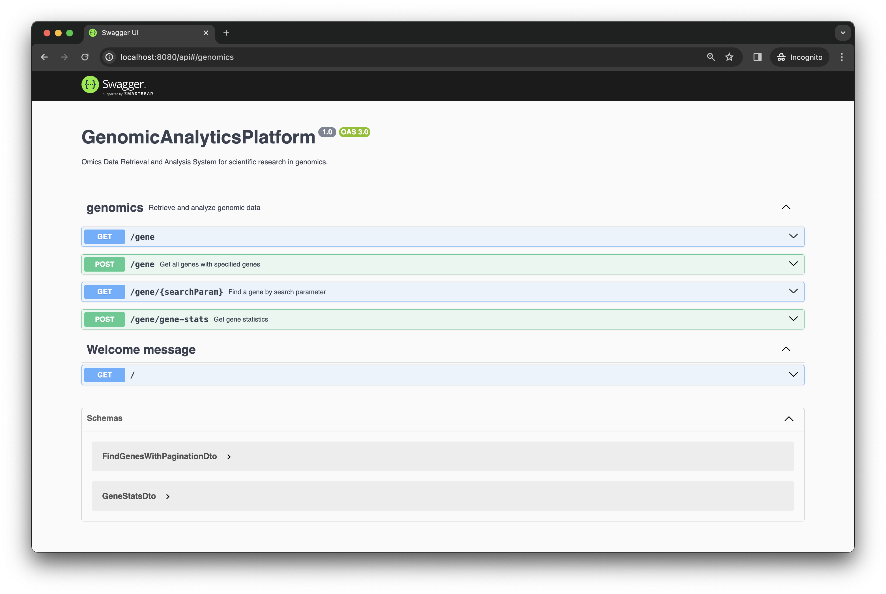
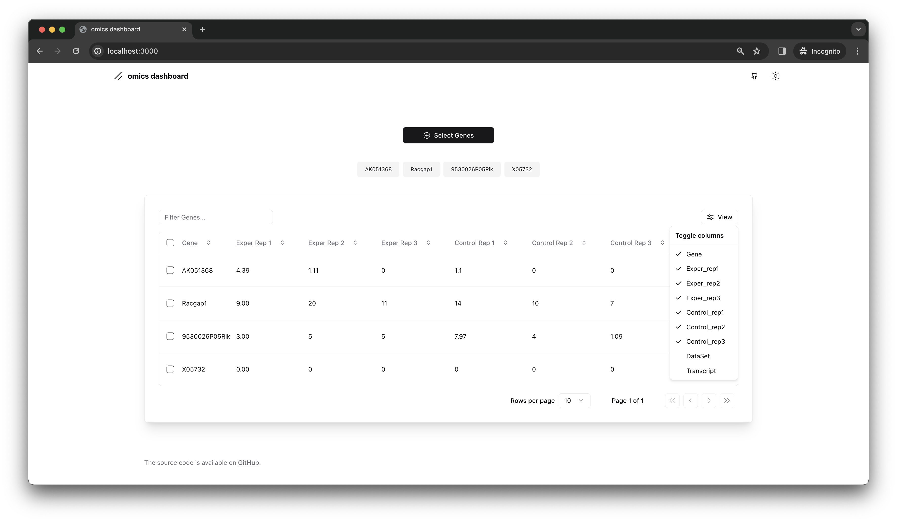
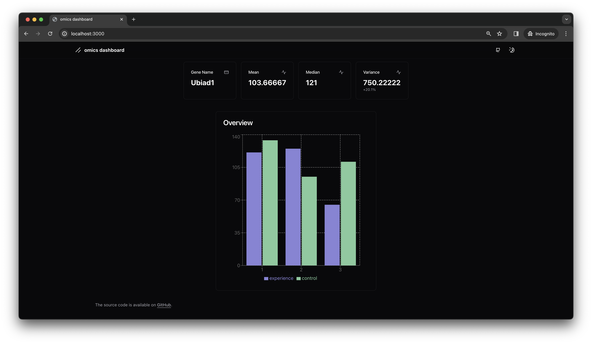
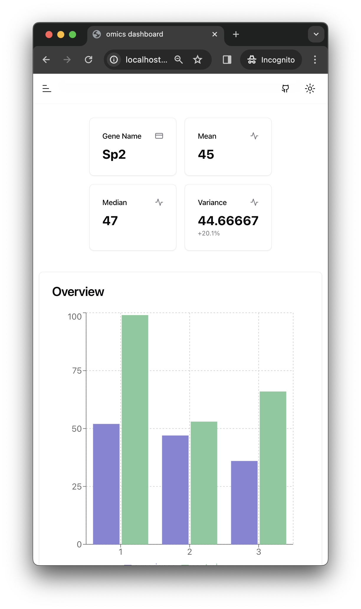
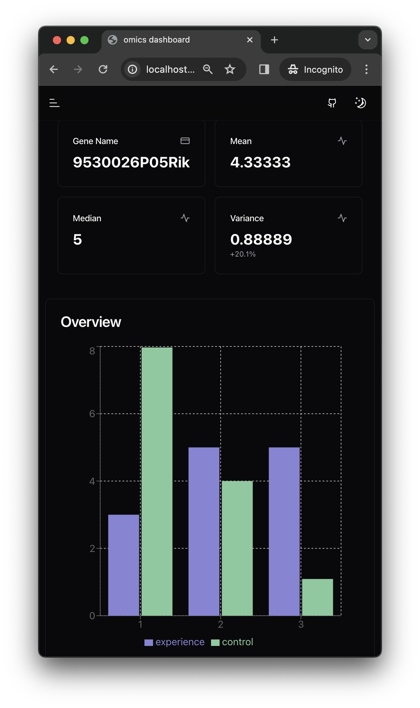

# Genomic-Analytics-Platform
GenomicAnalyticsPlatform: A robust tool for omics data retrieval, analysis, and visualization, designed to empower scientific research in genomics. Features an intuitive UI and advanced analytical capabilities for gene expression data. Ideal for researchers and scientists seeking deep genomic insights.

- ⚡ **[API](api/Readme.md)** : Contains documentation for the API module, which provides endpoints for data retrieval and analysis.
    - FASTAPI endpoint: 
        - Local: http://localhost:8080/api
        - **Live**: http://144.24.160.60:8080/api 👈

- 🚀 **[Dashboard](dashboard/Readme.md)**: Provides information about the dashboard module, which offers an intuitive user interface for visualizing and exploring genomic data.
    - Dashboard url:
        - Local: http://localhost:3000
        - **Live**: http://144.24.160.60:3000 👈

- **[MongoDB Data Insert](data/mongodb-data-insert/Readme.md)**: Includes instructions on how to insert data into MongoDB for further analysis.
- **[Anomaly Detector Trainer](data/anomaly-detector-trainer/Readme.md)**: Describes the anomaly detector trainer module, which helps in training models to detect anomalies in genomic data.

| [API](api/Readme.md) | [Dashboard](dashboard/Readme.md) |
|----------|----------|
|  |   Light Mode|
| |  Dark Mode|
|

| [Mobile-Dashboard](dashboard/Readme.md) | |
|----------|----------|
| | |


## How To Use It

Install docker ***desktop*** or ***orbstack***
```bash
make setup
```
open http://localhost:3000

## Commands

### Start All Services and Seed Database

Start All Services and Seed Database

To start all services and seed the database, run:

```bash
make setup
```

### Start Services
To start all the services, use:

```bash
make services-up
```

### Stop Services
To stop all running services, use:

```bash
make services-down
```

### Seed Database
To seed the database, run:
```bash
make run-data-seeder
```

### Build
For building the application, run:
```bash
make build
```

### Fresh Start
For a fresh start (rebuild and restart everything), use:
```bash
make fresh-start
```

### Delete everything related with docker ( also your other projets will be deleted)
```bash
docker system prune -a --volumes
```

# Author
Murat Mayadağ
