# Genomic-Analytics-Dashboard

## Introduction

A brief introduction to your project. Describe the purpose and functionality of your application.

## Technology Stack

- **Next.js**: Enhances React-based web applications with server-side rendering and static site generation.
- **React**: Facilitates building interactive UIs with reusable components.
- **Jotai**: Manages application state with a minimalistic and efficient approach.
- **Radix UI**: Provides unstyled, accessible components for customizable design systems.
- **Nivo**: Offers rich data visualization components based on D3.js for React apps.
- **Recharts**: A composable charting library built with React components for easy integration.
- **TypeScript**: Adds static typing to JavaScript for improved code quality and developer experience.
- **@tanstack/react-table**: A lightweight yet powerful data grid library for React.
- **Dark Mode and Light Mode**: User-selectable themes to enhance accessibility and user experience.
- **Debounced** input
- Service messages covered with **toast**

## Features

- **Responsive Design**: Ensures a seamless user experience across various devices and screen sizes.
- **Data Visualization**: Utilizes Nivo and Recharts for displaying complex data through intuitive charts and graphs.
- **Accessibility**: Committed to accessible design principles, with features and components that are inclusive for all users.
- **Dark and Light Modes**: Users can toggle between dark and light themes for better readability and personal preference.

## Installation

```bash
pnpm install
```

### update api url in .env

```bash
cp .env.example .env
```

| Variable            | Value                  |
| ------------------- | ---------------------- |
| NEXT_PUBLIC_API_URL | http://localhost:3000/ |

# Run the application in development mode

```bash
pnpm run dev
```

# Run the application

```bash
pnpm run start
```

# Build for production

```bash
pnpm run build
```

## API url

Open 👉 http://localhost:3000 with your browser to see the result.

## Dashboard Public url
http://144.24.160.60:3000

## ScreenShots
Light Mode - Desktop
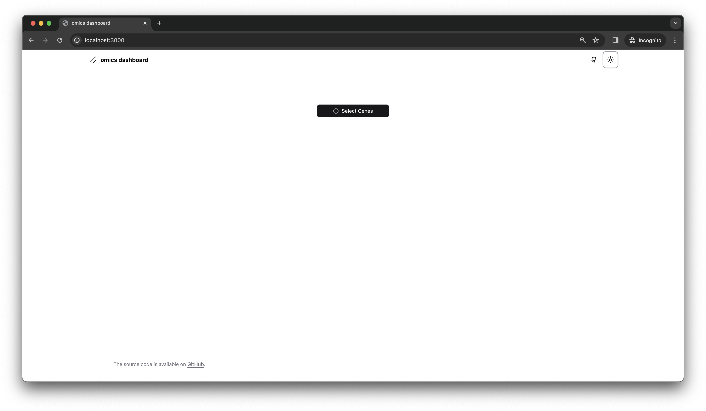
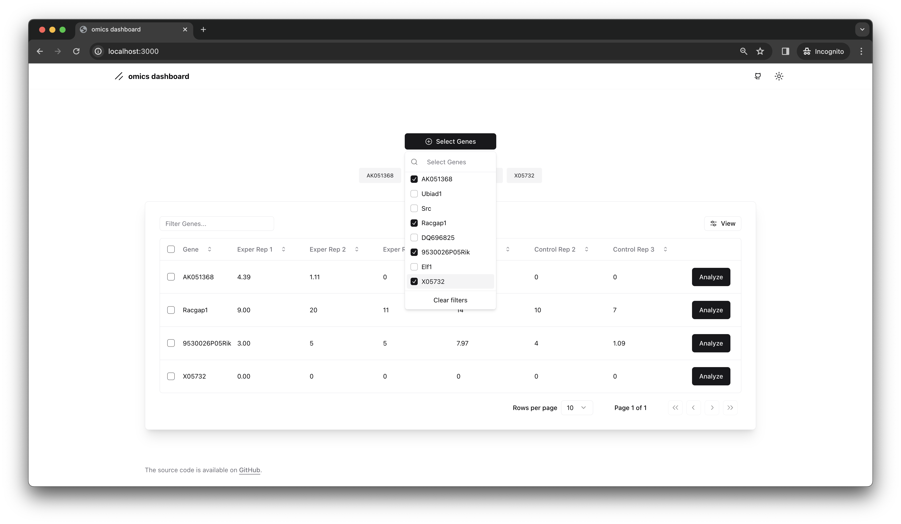

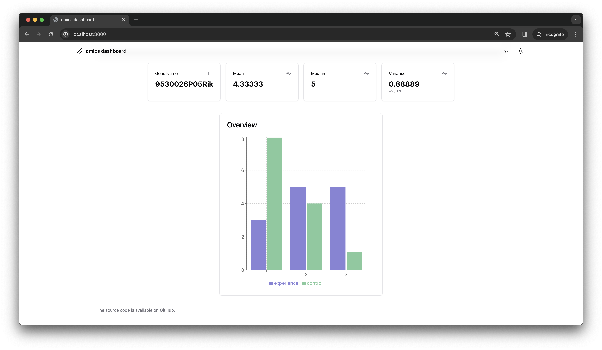

Dark Mode - Desktop
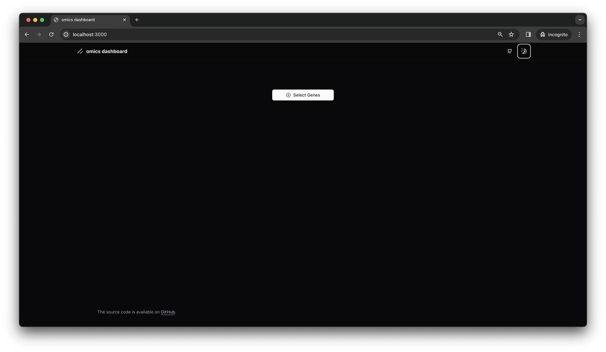
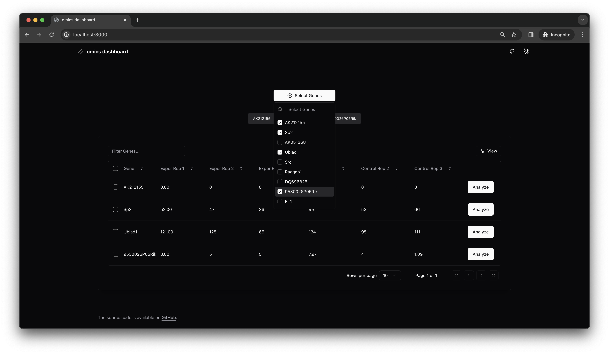
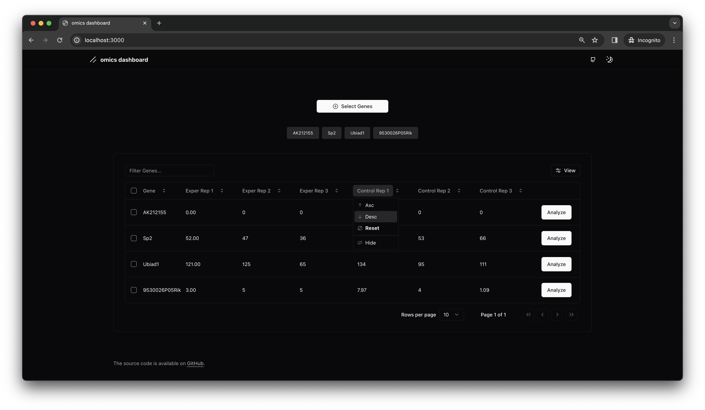


Light Mode - Mobile
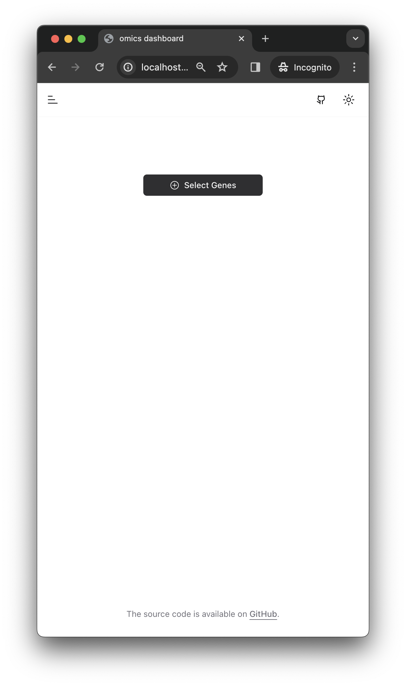
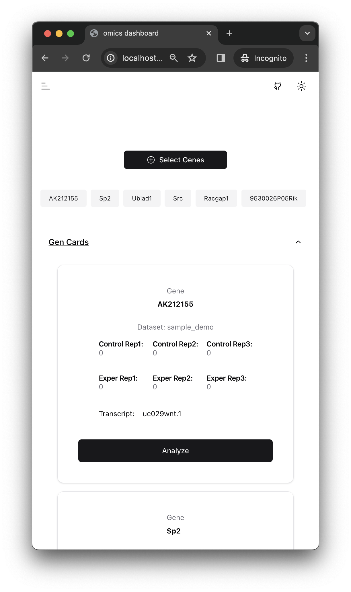
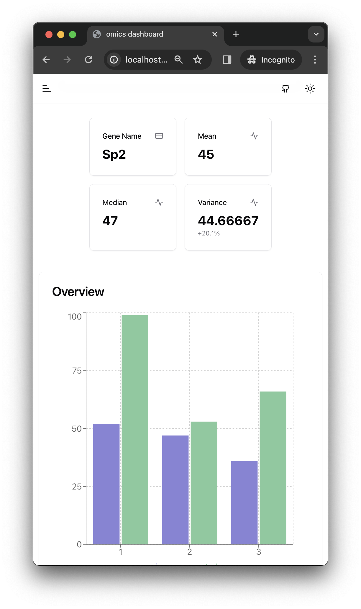

Dark Mode - Mobile
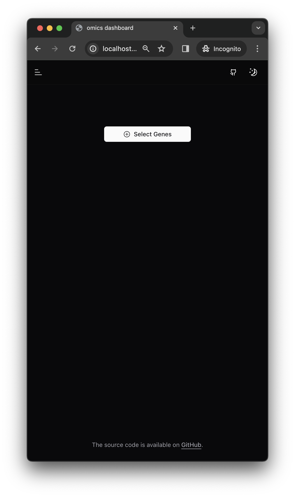
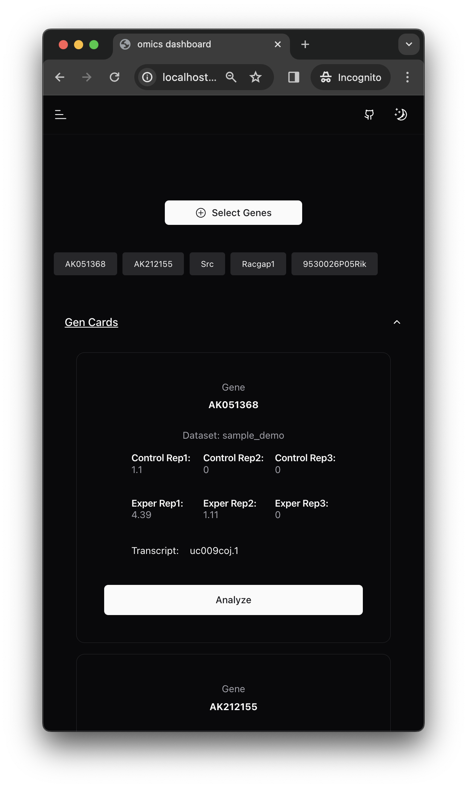


## License

Nest is [MIT licensed](LICENSE).

## Author

Murat Mayadağ
